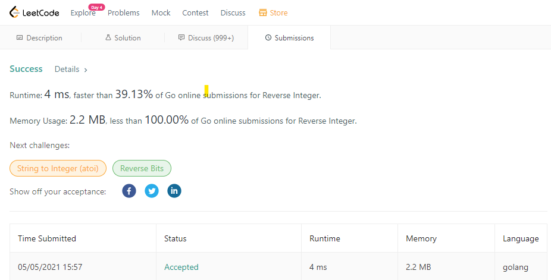

# LeetCode info
https://leetcode.com/problems/reverse-integer/

# Results from Leetcode

# The thoughts on problem solving
1. Process every digit from the input - mod 10 to get the digit
2. Append the digit to result and push the existing results to higher digit
3. Check if the result over the boundary

# The time complexity & space complexity
* Time complexity: O(n)
* Space complexity: O(1)