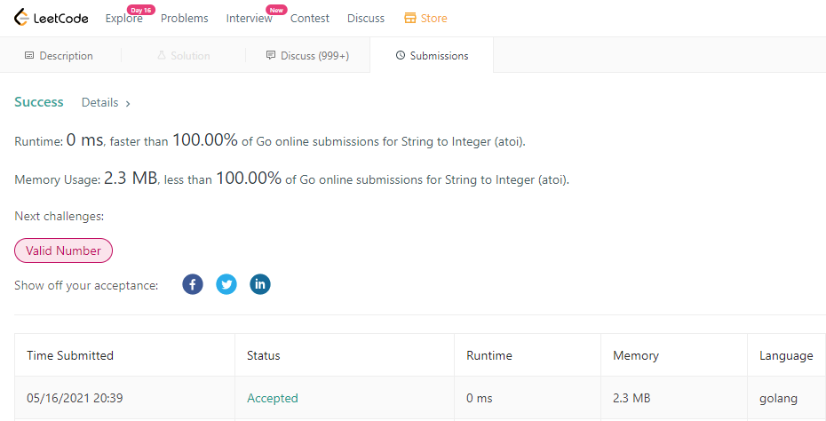

# LeetCode info
https://leetcode.com/problems/string-to-integer-atoi/

# Results from Leetcode

# The thoughts on problem solving
1. Trim all space from given string
2. Process the sign from the string
3. Foreach every char from the string to add to the result
4. Check the value range

# The time complexity & space complexity
* Time complexity: O(n)
* Space complexity: O(1)